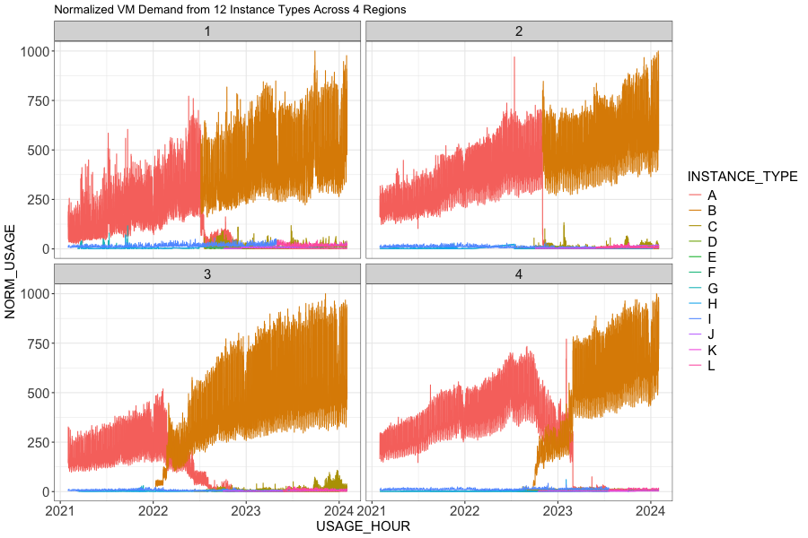
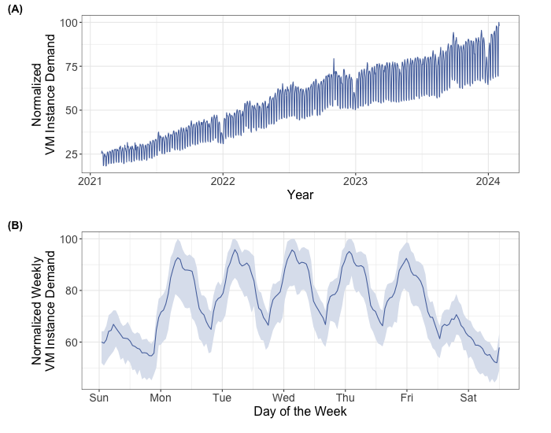
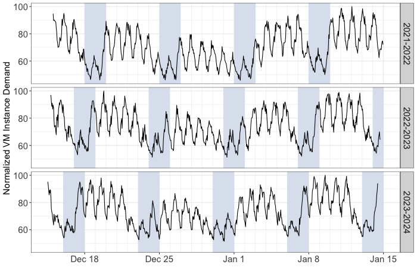
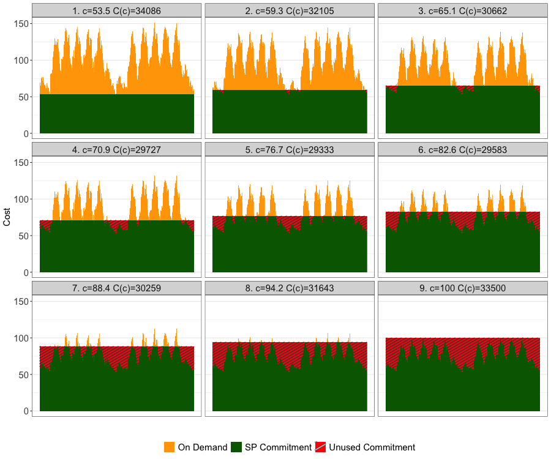

# Snowflake Cyclic VM Demand Dataset

This repository contains documentation for the dataset that accompanies our
ICPE 2025 paper, "Shaved Ice: Optimal Compute Resource Commitments for
Dynamic Multi-Cloud Workloads".  It also includes example [R](http://www.r-project.org) and Python notebooks to
read and visualize the data, including scripts to reproduce the
figures and analysis results in the paper.

## Dataset

The dataset contains normalized and obfuscated hourly data about VM demand in four example Snowflake deployments over a period of 3 years from 11/1/2021 to 10/31/2024.
Each hour includes (type of VM, region, number of VMs of that type) used at that time.
This dataset is available in both CSV and Parquet formats and can be obtained from the Downloads page.

### Related Datasets

The [Snowset dataset](https://github.com/resource-disaggregation/snowset) provides information about 70 million queries run on Snowflake in 2018 to accompany the paper "Building an Elastic Query Engine on Disaggregated Storage" by Vuppalapati, et al.

This earlier data set shows the clear diurnal and weekly patterns of Snowflake workloads, particularly for read-only ad-hoc and OLAP queries.
It also provides detailed statistics collected from each of the 70 million queries.
However, this trace covers only 2 weeks of time and so is not sufficient for analysis of longer-term strategies to purchase commitments and optimize cloud compute spending. 

### Schema

* *Timestamp*: An hourly timestamp for the record.
* *SKU Type*: This field is obfuscated with the precise SKU identifier from the Cloud Service Provider mapped into a capital letter.
* *Region*: The region where the SKU was deployed.  This field is obfuscated with the precise region name from the Cloud Service Provider mapped into a number between 1 and 4.
* *Count*: The number of VMs deployed in that sku, region, and hour.  This field is normalized such that the largest sku, region, hour tuple is set to 10000 and other values are scaled linearly to the nearest whole number.

## Scripts

The scripts directory has some scripts to reproduce the figures and analysis in the paper.

* *[IntroAnalysis.Rmd](IntroAnalysis.Rmd)*: Simple reading and visualization of the dataset in R ([pdf notebook](IntroAnalysis.pdf)).



* *[IntroAnalysis-py.ipynb](IntroAnalysis-py.ipynb)*: Simple reading and visualization of the dataset in Python.

* *[figures/timeseries.Rmd](figures/timeseries.Rmd)*: Snowflake Workload Analysis ([pdf notebook](figures/timeseries.pdf))




* *[figures/Optimization.Rmd](figures/optimization.Rmd)*: Visualization and optimization of minimum-cost savings plan levels. ([pdf notebook](figures/optimization.pdf))



* *[animation/optimization.Rmd](animation/optimization.Rmd)*: Animation of the optimization process ([pdf notebook](animation/optimization.pdf))


## Privacy Concerns

There are no identifiers in the dataset that could potentially reveal
a customer's identity.  Public access to the information in this dataset
does not lead to any privacy or other ethical concerns.

Because only a subset of Snowflake deployments are included and the numbers are normalized, neither the absolute nor relative growth rates or size of Snowflake deployments can be inferred from this dataset.
## Contact

Murray Stokely (murray.stokely@snowflake.com)

## Usage

Information in this dataset is open to the public for use in research and education purposes.
Kindly cite the following publication if you are using our dataset:

```
@inproceedings {snowflake-icpe25,
author = {Murray Stokely and Orestis Kostakis and Neel Nadgir},
title = {Shaved Ice: Optimal Compute Resource Commitments for Dynamic Multi-Cloud Workloads},
booktitle = {Proceedings of the ACM/SPEC International Conference on Performance Engineering},
year = {2025},
publisher = {Association for Computing Machinery},
address = {New York, NY, USA},
}
```